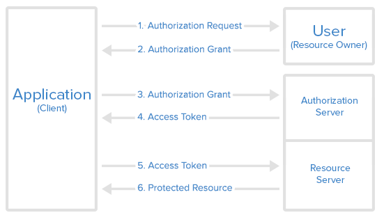

### How to use this spring-boot project

- Install packages with `mvn package`
- Run `mvn spring-boot:run` for starting the application (or use your IDE)

Application (with the embedded H2 database) is ready to be used ! You can access the url below for testing it :

- Swagger UI : http://localhost:8089/swagger-ui.html
- H2 UI : http://localhost:8089/h2-console

> Don't forget to set the `JDBC URL` value as `jdbc:h2:mem:testdb` for H2 UI.

### Instructions

- download the zip file of this project
- create a repository in your own github named 'java-challenge'
- clone your repository in a folder on your machine
- extract the zip file in this folder
- commit and push

- Enhance the code in any ways you can see, you are free! Some possibilities:
  - Add tests
  - Change syntax
  - Protect controller end points
  - Add caching logic for database calls
  - Improve doc and comments
  - Fix any bug you might find
- Edit readme.md and add any comments. It can be about what you did, what you would have done if you had more time, etc.
- Send us the link of your repository.

#### Restrictions
- use java 8

#### What we will look for
- Readability of your code
- Documentation
- Comments in your code 
- Appropriate usage of spring boot
- Appropriate usage of packages
- Is the application running as expected
- No performance issues

#### How to use this application
- Add the [Axa-lifeInsurance-Challange.postman_collection.json](Axa-lifeInsurance-Challange.postman_collection.json) from the directory to postman
- This application is secured with role and token management so first Sign-In using singin endpoint in postman json
- So Mainly roles are user and admin. For operation of creation and read employee details user can perform this and for update,delete and all employee list only admin can see this
- SignIn works for only user role. Any user can be created from signIn.
- Default Admin User Exists in the application.Details will be in [UserDetails](UserDetails.txt)
- Application uses the OAuth Autorization mechanism so to access url. you need to have token to access it
- For more details of getting the token please refer [How to get token](AccessToken.txt)

#### OAuth authorization flow

| :warning:   **Default Port of the application is change to 8080 -> 8089** |
|---------------------------------------------------------------------------|
#### Your experience in Java

Please let us know more about your Java experience in a few sentences. For example:

- I have 6+ years experience in Java and I started to use Spring Boot from 3.5 year
- I'm a mid level to Spring Boot
- I know Spring Boot well and have been using it for many years
